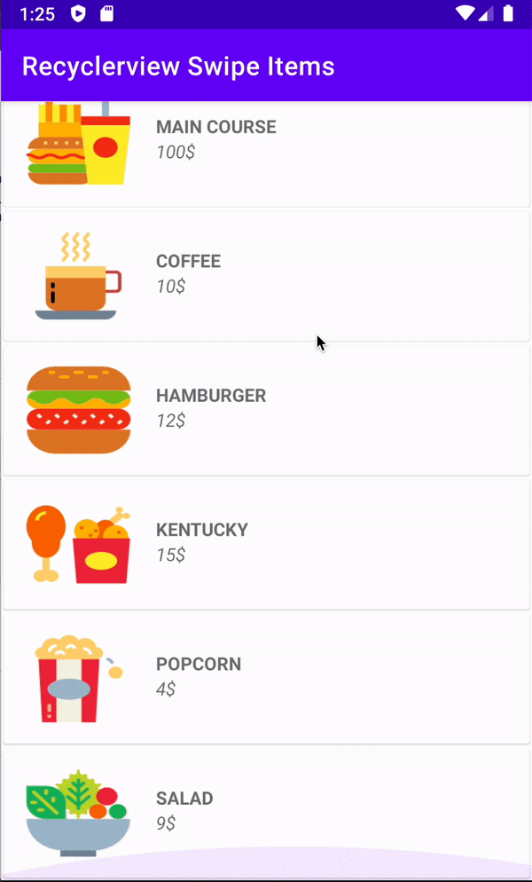

# Kotlin-Recyclerview-With-Swipe-Items
Kotlin Recyclerview With Swipe Items

Include : 

1 - RecyclerView With Sipe

2 - Make More Than 2 Button For Swipe

3 - Show Undo Button After Deleteing

# Dependency

`plugins {
    id 'kotlin-android-extensions'
}`

`implementation 'com.google.android.material:material:1.6.1'`

# Screenshot

# output

